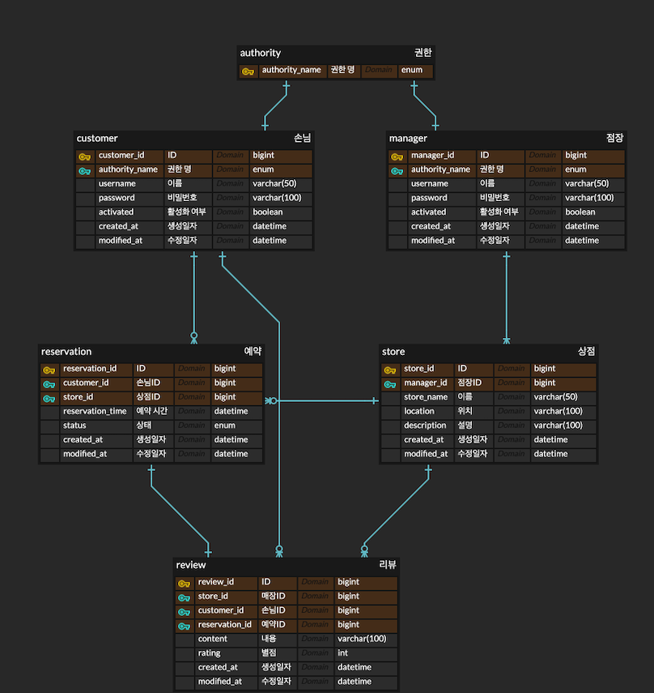
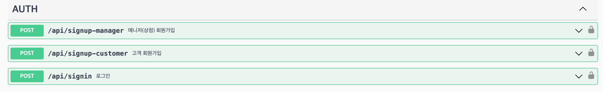
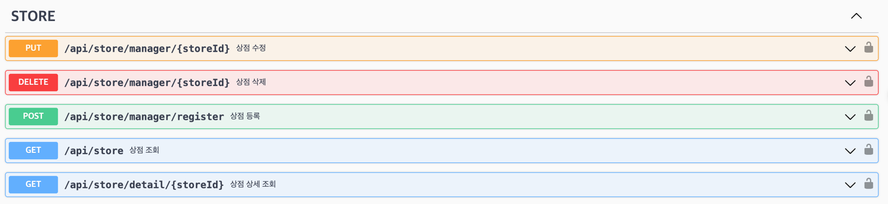
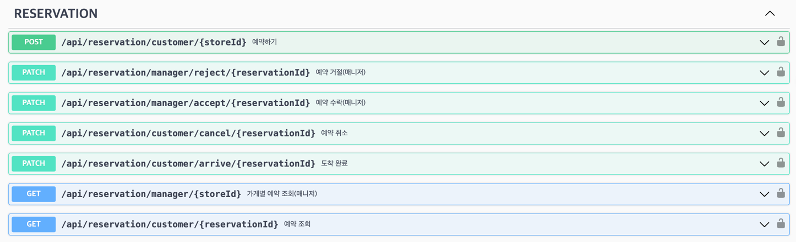
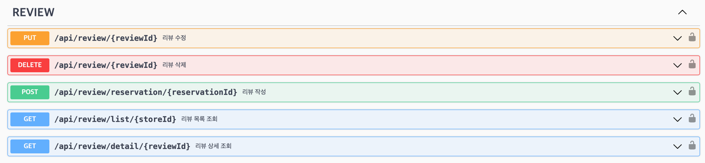

# 매장 예약 서비스

## 요구 사항

### ✅ Mission 1

- 공통 인증 구현
- 매장의 점장은 예약 서비스 앱에 상점을 등록한다.(매장 명, 상점위치, 상점 설명)
- 매장을 등록하기 위해서는 파트너 회원 가입이 되어야 한다.(따로, 승인 조건은 없으며 가입 후 바로 이용 가능)

### ✅ Mission 2

- 매장 이용자는 앱을 통해서 매장을 검색하고 상세 정보를 확인한다.
- 매장의 상세 정보를 보고, 예약을 진행한다. (예약을 진행하기 위해서는 회원 가입이 필수적으로 이루어 져야 한다.)

### ✅ Mission 3

- 서비스를 통해서 예약한 이후에, 예약 10분전에 도착하여 키오스크를 통해서 방문 확인을 진행한다.
- 예약 및 사용 이후에 리뷰를 작성할 수 있다.
- 서비스 이용 중 애로사항 발생 - 점장은 승인/예약 거절을 할 수 있다.

## 기술 스택

- Spring Boot 3.1.5
- Spring Data JPA
- Spring Security
- Java 17
- Docker
- JWT
- MySQL
- Swagger

## ERD

## API 명세서

> <http://localhost:8080/swagger-ui>

## 프로젝트 구조

모놀리식 아키텍처를 기반으로 구현하였습니다.

application, domain, core 모듈로 구성되어 있으며, 각 모듈의 역할은 다음과 같습니다.

- `application`: 비즈니스 로직을 구현합니다.
- `domain`: 비즈니스 로직을 구현하기 위한 도메인 모델을 구현합니다.
- `core`: 공통 모듈을 구현합니다.

<https://techblog.woowahan.com/2637/> 참고

## 나중에 해보고 싶은 것

1. application 모듈 분리 (멀티 모듈)
    - 서비스 분리 (예약 서비스, 매장 서비스, 리뷰 서비스, 인증 서비스)
2. Kafka를 이용한 비동기 통신
    - 예약 서비스에서 매장 서비스로 예약 정보를 전달할 때 비동기 통신을 이용하여 전달
3. ~~QueryDSL 적용~~ (완료)
    - JPA를 이용하여 쿼리를 작성하였는데, QueryDSL을 이용하여 쿼리를 작성해보고 싶음